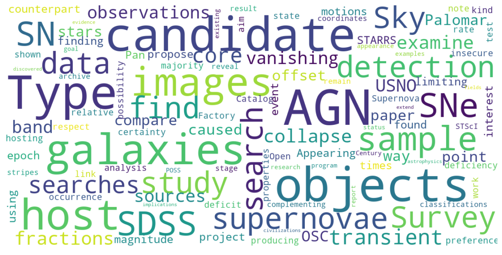

 Navigation shortcut.   

Go to &nbsp;

<a href="/academic-publications/#{{ year }}">{{ year }}</a>&nbsp;&nbsp;


 

  <ol reversed>
    
      
        
        <a class="anchor" id="{{ year }}"><h4>{{ year }}</h4></a>
      
      <li>
        {{ pub.author }} ({{ pub.year }}). 
		<i>{{ pub.title }}</i>. 
		{{ pub.ref }}.
        
           doi: <a href="http://dx.doi.org/{{ pub.doi }}">{{pub.doi}}</a>&nbsp;&nbsp; 
        
        
        
           links: <a href="{{ pub.link }}">{{pub.text}}</a>&nbsp;&nbsp; 
        
      </li> 
    
  </ol>
